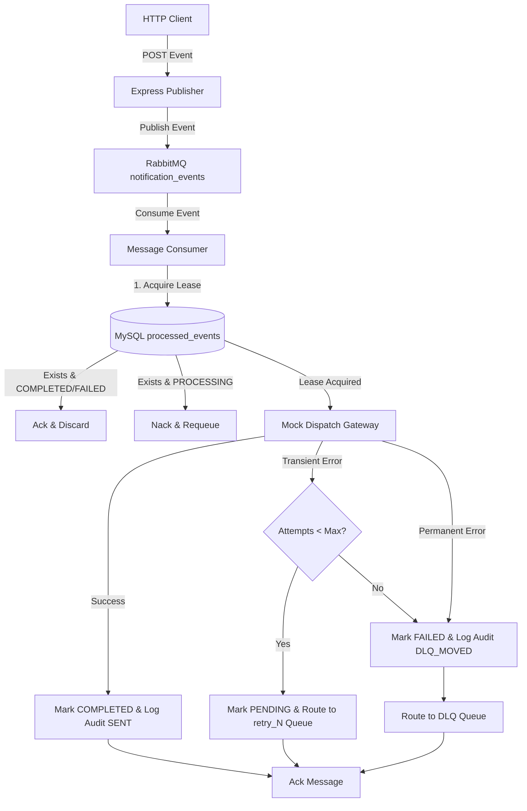

# Event-Driven Notification Service

A robust, fault-tolerant backend notification service built using a decoupled event-driven architecture. This system integrates a message broker (RabbitMQ) with a relational database (MySQL) to guarantee reliable, asynchronous, exactly-once message processing. It features consumer-side idempotency, a dynamic exponential backoff retry strategy, and routing to a Dead-Letter Queue (DLQ) for unprocessable messages.

---

## Technologies Used

* **Runtime:** Node.js (v20 LTS)
* **API Framework:** Express.js
* **Message Broker:** RabbitMQ 3.x (with Management Plugin)
* **Database:** MySQL 8.0
* **Dependencies:**
  * `amqplib` (RabbitMQ Client)
  * `mysql2/promise` (MySQL Pool Client)
  * `dotenv` (Environment Config)
  * `winston` (Structured JSON Logging)
* **Testing Stack:** Jest & Supertest (with ES Modules support)
* **Orchestration:** Docker & Docker Compose

---

## System Architecture Overview

The system operates on a clean **Producer-Consumer** pattern:



### Key Components

1. **Express Publisher:** Exposes a schema-validated endpoint `POST /api/v1/publish-notification-event` that accepts notification events and publishes them directly to RabbitMQ.
2. **RabbitMQ Broker:** Declares direct exchanges, routing keys, main queues, dead-letter queues, and dynamic retry queues.
3. **Database Audit & Idempotency Store:** MySQL tracks event status (`PENDING`, `PROCESSING`, `COMPLETED`, `FAILED`) and records audited logs of every dispatched notification.
4. **Resilient Consumer:** Subscribes to RabbitMQ and enforces the atomic idempotency checking and dispatching pipeline.

---

## Idempotency, Retry, and DLQ Mechanisms

### 1. Idempotency Check-and-Process Lease
To prevent side effects from duplicate messages (e.g., sending double SMS/Emails), the consumer enforces an atomic lease check on MySQL before starting dispatch:
* **First Delivery:** Consumer runs `INSERT INTO processed_events (event_id, status) VALUES (?, 'PROCESSING')`. Since `event_id` is a primary key, it succeeds atomically, granting the consumer the lease to process.
* **Concurrent Duplicate Delivery:** If another consumer receives a duplicate message simultaneously, the insertion fails with a Duplicate Key error. The consumer queries the status:
  * If `COMPLETED` or `FAILED`, it immediately acknowledges (`ACK`) the duplicate message to discard it safely.
  * If `PROCESSING`, it negatively acknowledges (`NACK`) with `requeue = true` to let the current handler finish.
  * If `PENDING` (from a scheduled retry), it executes an atomic update: `UPDATE processed_events SET status = 'PROCESSING' WHERE event_id = ? AND status = 'PENDING'`. If `affectedRows > 0`, it wins the lease for retry. Otherwise, it backs off.

### 2. Exponential Backoff Retries
If the mock dispatch fails with a transient error (e.g., network timeout), we retry with exponential backoff:
* Delay for attempt $i$ is calculated as: $InitialDelay \times BackoffFactor^{i-1}$.
* Instead of blocking the consumer thread, the consumer marks the database status as `PENDING`, publishes the message to a dedicated TTL queue (`notification_events_test_retry_i` or `notification_events_retry_i`), and acknowledges (`ACK`) the current message.
* When the queue TTL expires, RabbitMQ's Dead-Letter Exchange (DLX) automatically pushes the message back onto the main queue for processing.

### 3. Dead-Letter Queue (DLQ)
Messages fail permanently in two ways:
* **Validation/Schema Errors or Permanent Failures:** Routed directly to the DLQ (`notification_dead_letter_queue`) without retries.
* **Exhausted Retries:** If attempts exceed the configured maximum (`MAX_RETRIES`), the message status is marked `FAILED` in the database, the dispatch log is updated to `DLQ_MOVED`, and the message is published to the DLQ with the header properties storing the original error message and retry count.

---

## API Documentation

### Publish Notification Event

Manually publishes a notification event to the queue.

* **URL:** `/api/v1/publish-notification-event`
* **Method:** `POST`
* **Headers:** `Content-Type: application/json`
* **Request Body Schema:**
  ```json
  {
    "event_id": "string (UUID, required)",
    "type": "string (one of: 'email', 'sms', 'push', required)",
    "recipient": "string (non-empty, required)",
    "payload": {
      "subject": "string",
      "body": "string",
      "simulate_transient_failure": "boolean (optional, test flag)",
      "simulate_permanent_failure": "boolean (optional, test flag)"
    },
    "timestamp": "string (ISO 8601 Date, required)"
  }
  ```

#### Response Examples

* **`202 Accepted`** (Published to queue successfully)
  ```json
  {
    "status": "Accepted",
    "event_id": "a8b3c4d5-e6f7-48a9-80b1-c2d3e4f5a6b7"
  }
  ```
* **`400 Bad Request`** (Invalid schema)
  ```json
  {
    "error": "event_id must be a valid UUID string"
  }
  ```
* **`500 Internal Server Error`** (Broker connection down)
  ```json
  {
    "error": "Failed to publish event to message queue"
  }
  ```

---

## Setup & Running Locally

### Prerequisites
* [Docker Desktop](https://www.docker.com/products/docker-desktop/) (includes Docker Compose)

### 1. Configure Environment
Copy `.env.example` to `.env`:
```bash
cp .env.example .env
```
Default parameters are pre-configured to point to Docker-managed services.

### 2. Boot Containers
Build the Node service image and boot all services (MySQL, RabbitMQ, and the App) in detached mode:
```bash
docker-compose up -d --build
```
This automatically:
* Runs health checks to ensure dependencies are fully ready.
* Creates the schema and seeds the database in MySQL.
* Hooks up the consumer and starts the Express server on port `8080`.

Verify container health:
```bash
docker-compose ps
```

---

## Running Tests

Automated tests are divided into unit tests (validations, math helper checks) and integration tests (asserting database transactions, RabbitMQ queue exchanges, DLQ routing, and retry loops).

Run the tests inside the container:
```bash
docker-compose exec -T notification_service npm test
```

Expected output:
```bash
PASS tests/integration/flow.test.js
PASS tests/unit/validation.test.js
PASS tests/unit/retry.test.js

Test Suites: 3 passed, 3 total
Tests:       18 passed, 18 total
Snapshots:   0 total
Time:        4.484 s
```

---

## Troubleshooting Tips

* **Database Port Conflict:** If port `3309` is occupied on your host, edit `ports` in `docker-compose.yml` to point to a free port (e.g. `3310:3306`) and adjust `DB_PORT` in your local `.env`.
* **RabbitMQ Port Conflict:** If port `5672` or `15672` is already bound, modify the ports in `docker-compose.yml` for the `rabbitmq` service.
* **Inspect Queue Content:** Access the RabbitMQ Management Console via browser at `http://localhost:15672/` (Username/Password: `guest`/`guest`) to view messages in queues, exchange maps, and bindings.
* **Examine Database Content:** Access MySQL inside the container:
  ```bash
  docker exec -it notification_mysql mysql -uroot -prootpassword notifications_db
  ```
* **Rebuild Application:** If you modify codebase files locally, rebuild the container:
  ```bash
  docker-compose up -d --build
  ```